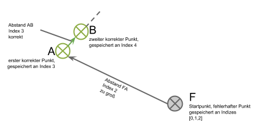
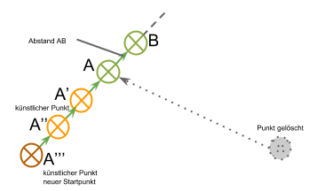
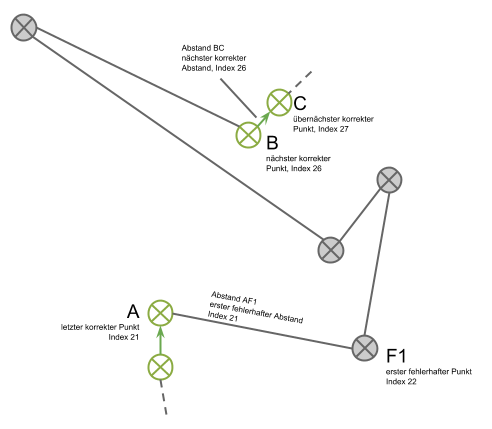
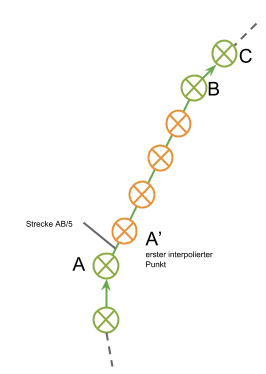

# wanderQ

*wanderQ* ist eine Web-Applikation basierend auf Daten des [MediaQ-Projekts](http://mediaq.usc.edu/), einer Plattform zur Sammlung und Aufbereitung von nutzergenerierten, geogetaggten Videos der University of Southern California (USC).

*wanderQ* wurde im Sommersemester 2015 an der LMU München im Rahmen des Seminars ["MediaQ: Practical Seminar on Big Data for Social Media"](http://www.dbs.ifi.lmu.de/cms/Hauptseminar_%22MediaQ:_Practical_Seminar_on_Big_Data_for_Social_Media%22) entwickelt.

Die App ist unter folgender Adresse zu erreichen: [http://app-qubertmedia.rhcloud.com/]()

## Idee

Das Ziel des Projekts war, die in der MediaQ-Datenbank verfügbaren Videos in geeigneter Weise aufzubereiten und miteinander in Beziehung zu setzten, sodass das Entdecken und Erkunden eines Ortes für den Nutzer interessant und kurzweilig ist.

Daraus entwickelte sich die Idee, dem Nutzer zu ermöglichen, während der Wiedergabe eines Videos in andere Videos zu springen, sobald sich deren Pfade überschneiden. Der Nutzer kann durch Auswahl der Kreuzungspunkte mehrere kurze Videos zu einem langen Videopfad "zusammenklicken" und so auf "Wanderung" gehen. Zusätzlich wurde eine spielerisches Element integriert. (TODO: weiter ausführen)

## Implementierung

Für das Server-Backend der App wurde [NodeJS](https://nodejs.org/) zusammen mit [Express](http://expressjs.com/) und [MongoDB](https://www.mongodb.org/) verwendet. Das Frontend nutzt [jQuery](https://jquery.com/) und die [Google Maps API](https://developers.google.com/maps/documentation/javascript/?hl=de).

Die App wird auf [Openshift](https://openshift.redhat.com) gehostet.

## Backend

### MongoDB

Um die Geodaten der Videos geeignet aufzubereiten und zu indizieren, werden diese nicht direkt aus der MySQL-Datenbank von MediaQ bezogen, sondern zunächst vorverarbeitet und in einer eigenen Datenbank zwischengespeichert. MongoDB wurde ausgewählt, da es durch seine dokumentenbasierte Natur einen natürlichen Match zu NodeJS und Javascript darstellt und außerdem geospatiale Datentypen (im [GeoJSON](http://geojson.org/) format) und [Indexstrukturen](http://docs.mongodb.org/manual/applications/geospatial-indexes/) unterstützt. Letzteres ist intern offenbar mit Hilfe von Quadtrees implementiert, die Dokumentation hierzu ist jedoch [spärlich](http://docs.mongodb.org/manual/core/geospatial-indexes/).

In der MediaQ-Datenbank ist für jede Sekunde eines Videos ein Datenpunkt abgelegt. Für jedes Video werden diese zunächst zu einer Trajectory aggregiert. Videos, die nur eine distinkte Position aufweisen, werden nicht berücksichtigt, da für diese offensichtlich keine Pfadschnittpunkte berechnet werden können. Die Startkoordinaten des Videos werden nochmals extra gespeichert. Außerdem wird die Gesamtlänge der Trajectory berechnet, um später im Frontend zu kurze Pfade auszufiltern.

Ein beispielhaftes Dokument in der Datenbank sieht demnach so aus:
```
{
    "_id": ObjectID("55a639fe2bddbb981698d0c8"),
    "VideoId": "4C7728F367_2014_9_26_Videotake_1411786237296.mov",
    "Keywords": "",
    "location": {
        "type": "Point",
        "coordinates": [
            -118.43789753516,
            34.02255627329801
        ]
    },
    "trajectory": {
        "type": "LineString",
        "coordinates": [
            [
                -118.43789753516,
                34.02255627329801,
                1,
                1411786229355,
                242.43751525879,
                -45.845058441162,
                12.057342529297,
                0.1,
                51
            ],
            [
                -118.43786191207,
                34.022521572219006,
                2,
                1411786229355,
                249.08416748047,
                -45.774036407471,
                14.936645507812,
                0.1,
                51
            ],
            [
                -118.43782628898,
                34.02248687114,
                3,
                1411786231357,
                263.61842346191,
                -45.632015228271,
                20.252258300781,
                0.1,
                51
            ],
            [
                -118.43779066589,
                34.022452170061,
                4,
                1411786232378,
                269.33044433594,
                -46.058101654053,
                20.252258300781,
                0.1,
                51
            ],
            [
                -118.4377550428,
                34.022417468982,
                5,
                1411786233472,
                248.05084228516,
                -46.62622833252,
                13.75537109375,
                0.1,
                51
            ],
            [
                -118.43777809303,
                34.022468137587,
                6,
                1411786234589,
                218.06396484375,
                -46.697250366211,
                1.8690490722656,
                0.1,
                51
            ],
            [
                -118.43772461649,
                34.022435029069,
                7,
                1411786235358,
                212.91046905518,
                -47.691463470459,
                -0.9364013671875,
                0.1,
                51
            ]
        ]
    },
    "distance": 32
}
```

Die einzelnen Koordinaten der Trajectory beinhalten jeweils alle von MediaQ bereitgestellten Metainformationen in der Reihenfolge `[Longitude, Latitude, FovNum, TimeCode, ThetaX, ThetaY, ThetaZ, alpha, R]`.

#### Qualität der Daten

Es wurde festgestellt, dass die von MediaQ bereitgestellten Geo-Daten von so schlechter Qualität sind, dass eine brauchbare Umsetzung der Applikation ohne Weiteres nicht möglich war. Grund waren Ausreißer und Sprünge in den Positionsdaten, vor allem in den ersten Sekunden der Videos, wo oftmals offenbar keine stabile GPS-Verbindung bestand. Um das Problem zu lösen, werden die Trajectories in einem Zwischenschritt geglättet und von den größten Ausreißern befreit. Dieser Teil ist im Abschnitt [Outlier Detection / Trajectory Smoothing](#outlier-detection--trajectory-smoothing) beschrieben.

#### Geo-Indizierung

Auf den Attributen `location` und `trajectory` müssen Anfragen effizient durchführbar sein: Die `location` wird genutzt, um mittels eines Range-Queries alle Videos zu selektieren, die sich im aktuellen Kartenausschnitts des Browsers befinden. Die `trajectory` muss bei einem Intersection-Query auf Schnittpunkte mit einem gegebenen Anfragepfad getestet werden. Zu diesem Zweck werden beide Felder mittels Mongos *2dsphere*-Index indiziert.

### Outlier Detection / Trajectory Smoothing

blablabla (Carl)

Zur Fehlerbehebung werden zunächst die Abstände zwischen allen Punkten in einem Trajectory berechnet. Dabei zeigten sich zwei "Hauptfehler:

- *Der Abstand ist null:* <br>
Dieser Fehler tritt auf, wenn dem Endgerät keine GPS-Daten vorlagen und stattdessen die Position der Funkzelle gespeichert wurde. 
 
- *Der Abstand ist unverhältnismäßig groß:* <br> 
Dies tritt auf wenn das mobile Endgerät, mit dem das Video aufgezeichnet wurde keine korrekten GPS-Daten mehr bzw. wieder korrekte GPS-Daten empfangen hat. Die meisten dieser Fehler treten einzeln auf, d.h. im Koordinaten-Array ist ein einzelner fehlerhafter Punkt ist von zwei korrekten Punkten umgeben. 

Gleichzeitig wird aus allen Abständen, die nicht null sind, ein Durchschnittswert berechnet. Dieser Wert wird bei der anschließenden Suche nach fehlerhaften Koordinaten als Obergrenze für den Abstand zweier Wegpunkte genutzt. Bei dieser Suche wurden zwei Szenarien betrachtet:

- *Die fehlerhaften Daten befinden sich am Anfang des Videos:* <br>
Dieser Fehler tritt meistens auf, wenn die filmende Person sich zuvor z.B. in einem Gebäude befunden hat. Die Abstände zum jeweils nächsten Wegpunkt werden mit dem zuvor errechneten Durchschnittswert verglichen. Die Anzahl der Abstände, die darüber liegen oder null sind, werden aufsummiert. Sobald ein Abstand (Punkt A nach B) wieder darunter liegt und nicht null ist, wird A als korrekt angesehen. Anschließend werden die Punkte vor A berechnet, indem der Vektor BA entsprechend der Anzahl an falschen Punkten wiederholt an A angehängt wird. Dies ist wichtig, um die Anzahl der Trajectory-Punkte konstant zu halten.<br>Ist die Anzahl der fehlerhaften Punkte am Anfang jedoch sehr hoch, würden dadurch wieder falsche Pfade entstehen. Deswegen werden auf diese Weise höchstens fünf künstliche Punkte berechnet. Sollten sich noch mehr fehlerhafte Punkte im Trajectory befinden, werden diese alle mit dem letzten (fünften) berechneten Punkt überschrieben.<br>Abschließend wird der letzte berechnete Punkt als Startpunkt des gesamten Videos festgelegt.




- *Die fehlerhaften Daten befinden sich in der Mitte des Videos:* <br>
Treten zu hohe Abstände in der Mitte des Videos auf, d.h. nachdem mindestens ein Abstand korrekt war, werden alle fehlerhaften Punkte zwischen zwei korrekten Punkten linear interpoliert. Wieder werden alle Punkte ab dem ersten fehlerhaften gezählt. Anschließend wird der Vektor AB durch diese Anzahl geteilt und die so erhaltenen Punkte ersetzen die fehlerhaften Punkte im Trajectory.





### API

blablabla (Timo)

## Frontend

blabla (Fabi/Alex)
